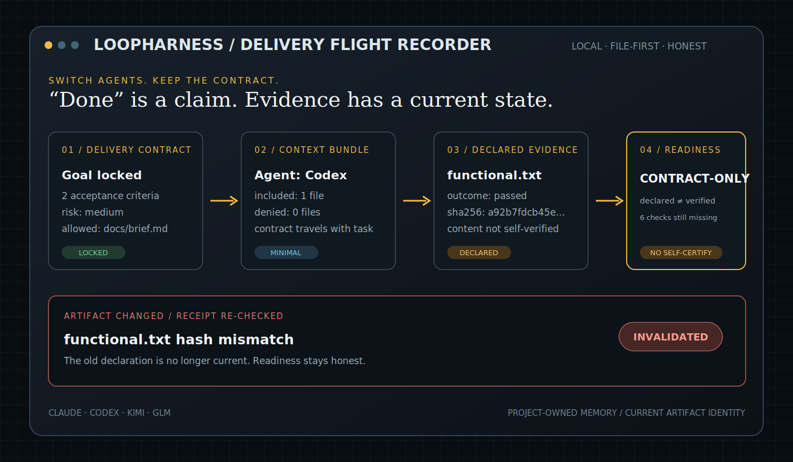

# LoopHarness

> **Switch coding agents without losing project memory — and stop accepting “done” without evidence.**

[中文](README.zh-CN.md)（非技术 PM / 超级个体 · 3 分钟上手） · Built for non-technical PMs, vibe coders, and solo builders using Claude, Codex, Kimi, or GLM.

[](https://github.com/penguinliao/loopharness/actions/workflows/ci.yml)
[](https://github.com/penguinliao/loopharness/releases/latest)
[](https://www.python.org/downloads/)
[](LICENSE)



AI coding agents are good at producing code. The hard part is carrying your intent from one agent to another — and knowing whether “done” means *a file exists* or *the result was actually checked*.

**Before LoopHarness**

- Your project context lives inside one chat.
- Switching from Claude to Codex or Kimi means explaining yourself again.
- The agent says “tests passed”; you may not know what evidence still exists.

**After LoopHarness**

- Project memory, decisions, and delivery criteria live in project-owned files.
- Every supported agent receives the same contract-bound context bundle.
- Artifact receipts are re-checked against the current file hash.
- A self-declared pass stays `Contract-only`; it cannot certify itself as production-ready.

## The four-part loop

1. **Remember** — keep explicit preferences, project notes, and decisions in `.agent-memory/`.
2. **Delivery Contract** — lock the goal, acceptance criteria, risk, and allowed context.
3. **Handoff** — compile the same minimal Markdown bundle for Claude, Codex, Kimi, or GLM.
4. **Prove** — register artifacts, re-check their identity, and report what is still unverified.

LoopHarness is a local, standard-library Python CLI. It does not require a cloud account or send project files to a LoopHarness server.

## Install

```bash
git clone https://github.com/penguinliao/loopharness.git && cd loopharness && bash install.sh
export PATH="$HOME/.local/bin:$PATH"
harness -h
```

The installer copies the local implementation to `~/.loopharness` and creates `~/.local/bin/harness`. Re-running it is idempotent and does not duplicate shell PATH entries.

## A three-minute honest demo

This demo connects to no model and no external service.

```bash
mkdir -p /tmp/loopharness-demo/docs && cd /tmp/loopharness-demo
printf 'Public release notes only.\n' > docs/brief.md

harness memory-init
harness contract "Ship a reliable demo" \
  --ac "Help command runs" \
  --ac "Artifact receipt remains current" \
  --allow docs/brief.md

harness context "Prepare the release" --agent codex --include docs/brief.md
printf '1 passed\n' > functional.txt
harness evidence functional functional.txt --outcome passed
harness readiness
```

Expected output includes:

```text
artifact 声明回执已登记 ✓（functional / passed）
  边界：只证明该文件登记时的身份与当前 hash，不证明内容真实或生产就绪。
当前交付等级：Contract-only
  当前声明回执（未独立验证）：functional
  尚缺已验证证据：deployment、functional、preview、production_health、rollback、security
```

In plain English: **Current delivery level: Contract-only.** The artifact has a current declaration, but no independent verification.

That `1 passed` file was written by the demo itself, so LoopHarness records it as **declared**, not independently verified. Now change the artifact and re-check:

```bash
printf 'changed\n' >> functional.txt
harness readiness
```

The current declaration disappears because the artifact hash no longer matches. LoopHarness did not prove the test result; it proved whether the registered artifact is still the same artifact.

## Use it with Claude, Codex, Kimi, or GLM

First create one contract. Then choose the adapter for the coding agent you are about to use:

```bash
harness context "Implement the accepted contract" --agent claude --include docs/brief.md
harness context "Implement the accepted contract" --agent codex  --include docs/brief.md
harness context "Implement the accepted contract" --agent kimi   --include docs/brief.md
harness context "Implement the accepted contract" --agent glm    --include docs/brief.md
```

Use **one** of those commands, then:

1. Tell that agent: `Read .delivery/context_bundle.md and implement only that contract.`
2. Let the agent produce a real artifact such as a test report, screenshot, or rollback log.
3. Register what exists: `harness evidence functional path/to/report.txt --outcome passed`.
4. Re-check current state: `harness readiness`.

The adapter is a file protocol. LoopHarness **does not log in** to any model, control its session, import your full chat history, or make all four agents share the same native hooks. Claude retains the original project-hook journey; Codex, Kimi, and GLM consume the same contract and context bundle through their own host workflow.

## Project memory, not chat-history scraping

`harness memory-init` creates:

```text
.agent-memory/
├── profile.md       # explicit working and communication preferences
├── projects/        # project-owned notes
├── decisions/       # durable decisions
├── receipts/        # retained evidence pointers
├── inbox.md         # learning candidates waiting for confirmation
└── audit.jsonl      # local activity trail
```

These files are portable because they live with your project. LoopHarness does **not** import your full Claude, Codex, Kimi, or GLM chat history. You decide what becomes durable memory.

## Declared vs. verified evidence

- **declared** — the CLI records the artifact path, size, SHA-256, outcome, and whether that artifact is still current. It does not prove the content is true.
- **verified** — available only through the Python library API for a trusted host that has actually performed an independent check. The CLI cannot upgrade its own declaration.

LoopHarness does not authenticate library callers and is not a sandbox against code that already has arbitrary write access to the project. Production decisions still require real tests, access control, backup/restore checks, and environment-specific acceptance.

## The original spec-first pipeline

The existing workflow remains available:

```bash
cd your-project
harness init
harness start "Build user search"
harness status
# The agent follows SPEC → IMPLEMENT → REVIEW → TEST and runs harness advance.
```

REVIEW runs self-review, `ruff`/`mypy` when available, a fresh-context review, and a cross-family review. Unavailable external reviewers are shown as skipped rather than silently reported as passed.

<details>
<summary>中文兼容说明：无人值守、二审与 Hermes 晨报</summary>

- **无人值守**：可由支持 `/loop` 的宿主持续调用 `harness advance`；`/loop` 不是 LoopHarness CLI，也不是内置 scheduler。运行只会得到三类诚实结果：完成、重复失败后 `stuck`，或仅黑盒预算耗尽时生成 `delivery_report.md` 的带病交付。
- **二审**：REVIEW 会尝试干净上下文和跨家族审查；CLI/API 不可用时明确显示 skipped，不冒充已审查。
- **Hermes 晨报**：宿主定时读取 `.harness/inbox.md`，由 PM 在早晨确认候选。LoopHarness 提供文件与 `harness hermes-show`，不自带 cron、launchd 或定时云服务。

</details>

## What LoopHarness is not

- Not a hosted multi-agent control plane.
- Not automatic full-history migration between model vendors.
- Not proof that a declared artifact is correct.
- Not a replacement for security review, human product acceptance, deployment controls, or monitoring.
- Not a promise of a Star count, universal accuracy, or automatic production readiness.

## Development

```bash
python3 -m pytest -q
ruff check .
python3 -m compileall -q claude_hh
```

Issues with a reproducible delivery failure are especially useful. See the [issue tracker](https://github.com/penguinliao/loopharness/issues), [changelog](CHANGELOG.md), and [v1.4 release notes](RELEASE_NOTES.md).

MIT License.
